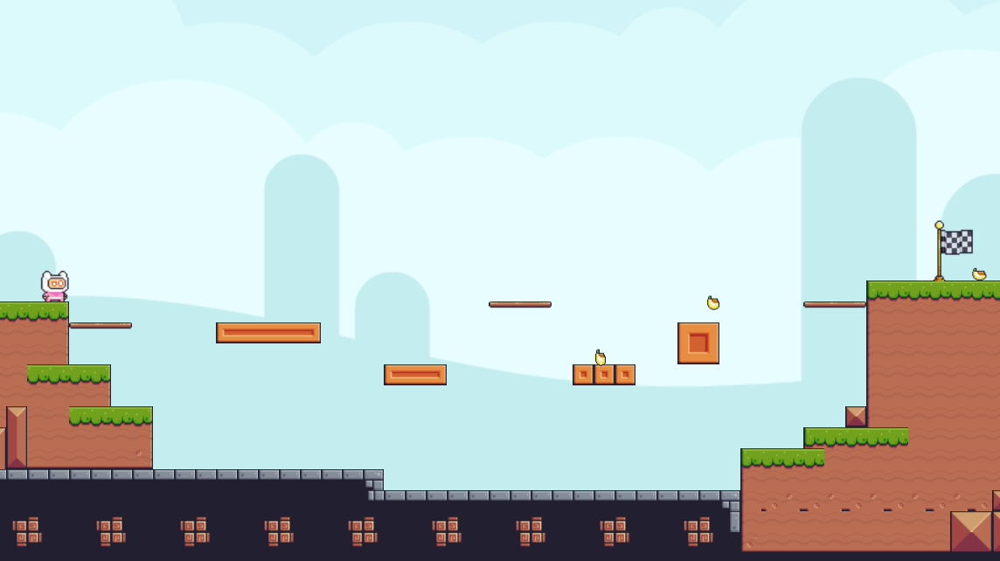
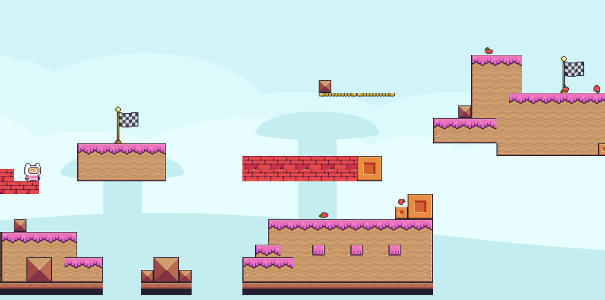
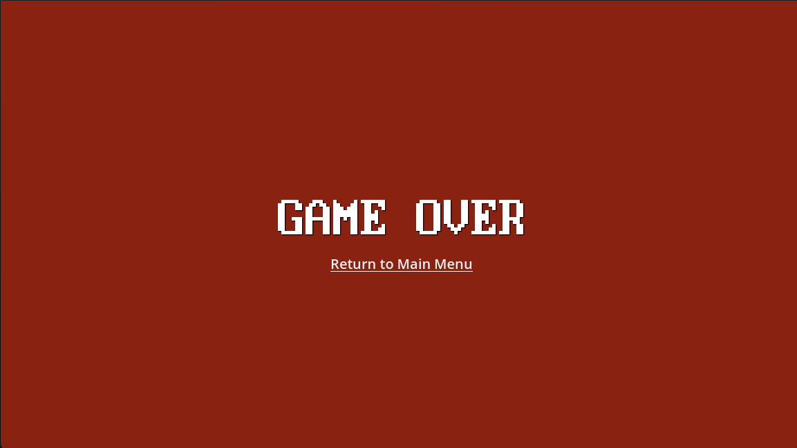
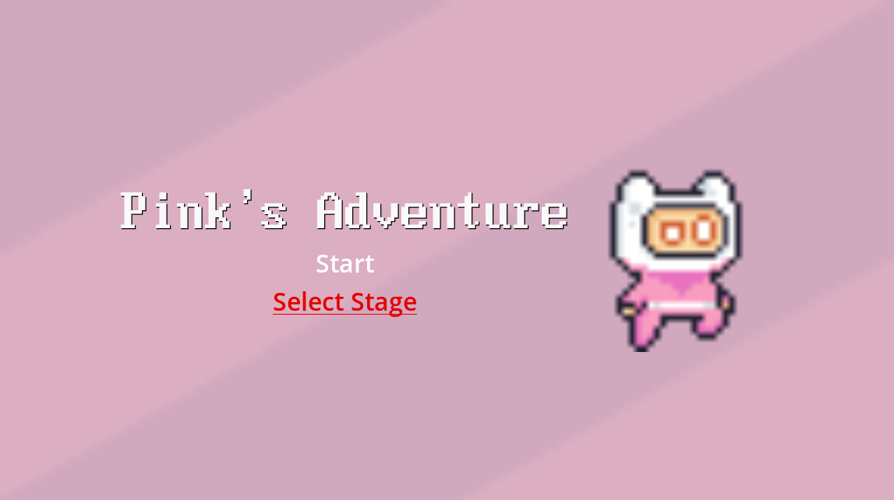
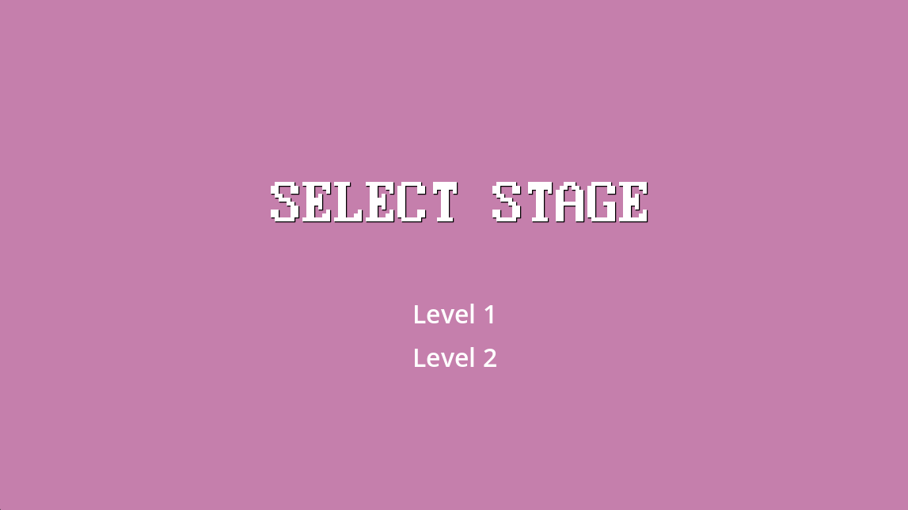

# Tutorial 6: Menu & In-Game GUI

## Implementasi

### Tombol pada layar game over untuk kembali ke menu utama.

1. Tambah node Button di scene `GameOver.tscn`.
2. Hubungkan tombol ke fungsi `_on_main_menu_button_pressed()`.
3. Gunakan `change_scene_to_file()` untuk kembali ke MainMenu.

### Fitur Select Stage (yang konon sudah ada button-nya di main menu namun tidak dihiraukan).

1. Tambahkan scene `SelectStage.tscn` di MainMenu.
2. Buat tombol untuk tiap level (misalnya: Level1, Level2).
3. Gunakan parameter level agar fungsi dapat digunakan untuk berbagai level.

### Layar dan efek transisi antar level, dari level 1 ke level 2.

1. Tambahkan `AnimationPlayer` di level untuk animasi `fade_out`.
2. Panggil animasi saat transisi menggunakan `change_level()`.
3. Gunakan await untuk menunggu animasi selesai sebelum pindah scene.

## Referensi
- [Godot 4 Documentation](https://docs.godotengine.org/en/stable/)
- [Pixel Adventure Assets](https://pixelfrog-assets.itch.io/pixel-adventure-1)