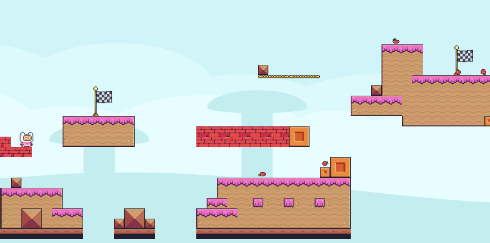

# Tutorial 4: Basic 2D Level Design

## Implementasi

### Membuat Tile Map Baru

1. Menggunakan tileset yang berbeda.

2. Mengatur collision untuk platform dan jurang.

### Menambahkan Spawner Rintangan

Membuat scene baru untuk rintangan unik (pisang untuk level 1 dan apel untuk level 2).

### Menambahkan Jurang

1. Menggunakan Area2D untuk mendeteksi jika pemain jatuh.

2. Menjalankan fungsi `reload_current_scene()` jika pemain masuk ke area jurang.

## Referensi
- [Godot 4 Documentation](https://docs.godotengine.org/en/stable/)
- [Pixel Adventure Assets](https://pixelfrog-assets.itch.io/pixel-adventure-1)